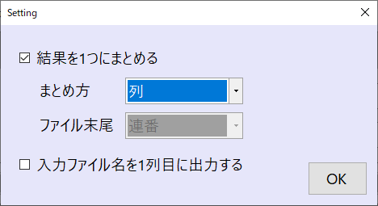

# CuNoA - Customizable Node Analysis

---

Windowsインストーラーをダウンロード（リンク追加予定）

---

## 研究室での解析用に作成したWindowsソフトウェア

プログラムを書いたことがない、でも、手作業では大変な量のデータがある。
そんな人の助けにちょっとだけなるかもしれない。

卒業するので後輩への研究の引き継ぎも兼ねて、どうせならオープンソースにしてしまおうと思いました。

プログラムが書ける人にとってはあまり役に立たないかも。
ただし、C#で独自処理を記述できるので、C#に慣れてるっていう人には「ファイル入出力等の定番処理を毎回書かなくてもいい」という恩恵はあります。

ご意見・ご要望があれば、気軽にIssue立ててくださいな。

## 「順番に実行」 - 処理はシンプルなフローに

処理は上から順番に実行されていきます。
使い方として以下の手順を踏むのをお勧めします。

1. 中間処理を挟まずにデータが読み取れているか確認

2. 1つのファイルに対して正しく処理できているか確認

3. 入力ファイルに複数ファイルを選択して複数ファイルを処理

※ 複数ファイルを入力ファイルとして指定した場合には1つのファイルに結果をまとめるか、
複数ファイルとしてそれぞれ出力するかをオプションで選べます。

## 独自処理のためのライブラリ作成機能

既に用意されている処理で満足できない場合、C#コードを書いて独自処理を追加できます。
コードエディタも用意しました。
処理に必要な部分だけに集中してほしいので、既存処理は全てテンプレートとして読み込めるようになりました。
書きたい処理に近そうな既存処理を選んで、参考にしてください。

もし、あなたが本格的にプログラムを書きたいのであれば、
`CustomizableAnalysisLibrary.dll`を参照してクラスライブラリを作ってください。
アプリケーションフォルダ以下に配置すれば、ソフトウェア起動時に読み取ります。

---
### ここからは実装の話
---

#### 使用ライブラリ

開発に当たり以下のパッケージを使用させていただきました。
ありがとうございます。

- [Math.NET Numerics](https://numerics.mathdotnet.com/)
- [Roslyn](https://github.com/dotnet/roslyn)
- [RoslynPad](https://github.com/roslynpad/roslynpad)
- [FolderBrowserEx](https://github.com/evaristocuesta/FolderBrowserEx)

#### ソフトウェアのコンセプトについて

処理は「分岐なしで、上から順番に実行していく」というシンプルな構成にしました。
それというのも、このソフトウェアの使用者に「プログラムできない人」を想定しているからです。

プログラムコードを書かない解析ソフトウェアというのはあるにはあって、
実際に候補として触ったこともあるんですが、私の肌には合わなかった。
ノードに複数のコネクタをつなげる形式だったりして、
ちょっと固有の処理をやろうとすると条件分岐やら色々あってごちゃごちゃになってしまうという経験がありまして。
これを後輩に教えるのは厳しいと感じました。

「もしxxだったらooする」というのは、わりかし複雑な思考回路だと思っています。
それを頭の中で順序立ててマウスカチカチして繋げてノードとコネクタを組み上げられるなら、
それもうプログラミングの文法を知らないだけのプログラムできる人じゃんって思うわけです。

#### コードの書き方について

GUIアプリケーション作るってなった時に、WPFとか最もモダンなフレームワーク使うほうがいいというのはそれはそうなんだけど、
プログラマでも何でもない人にとってはWinFormsのほうが直観的だと思うんですよ。
将来、研究室の後輩がいじりたいってなった時に、MVVMとかだと、まずそこの学習コストが嵩んでしまうのは嫌だなと。
そういうことを考えて泥臭いコードになってます。

ちょっと開発を優先して手癖で処理を書いた部分もあるけど、サンプルコードもLINQを使わないように修正していきたいな、と思ってます。
